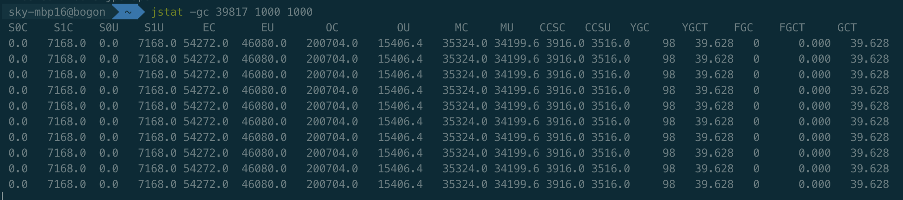
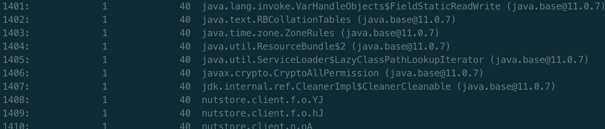
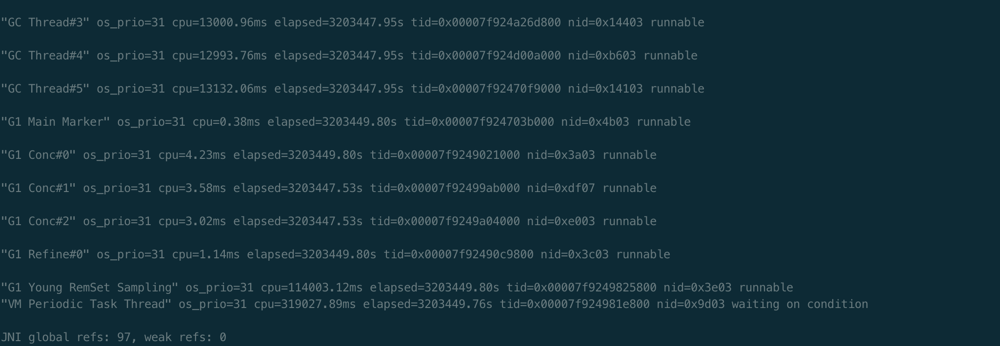

### 第一周作业

1.（选做）自己写一个简单的 Hello.java，里面需要涉及基本类型，四则运行，if 和 for，然后自己分析一下对应的字节码，有问题群里讨论。

略

**2.（必做）自定义一个 Classloader，加载一个 Hello.xlass 文件，执行 hello 方法，此文件内容是一个 Hello.class 文件所有字节（x=255-x）处理后的文件。文件群里提供。**

解答：

https://github.com/SkyMing1024/java-advanced-exercise/blob/main/java-advanced-project/src/main/java/com/sky/week01/MyClassLoader.java

~~~java
public class MyClassLoader extends ClassLoader{

    @Override
    protected Class<?> findClass(String name) throws ClassNotFoundException {
        byte[] newByte = new byte[0];
        try {
            // 读取resources目录下文件
            byte[] bytes = FileUtil.toByteArray("asset/Hello.xlass");
            newByte = new byte[bytes.length];
            // 获取原始字节码
            for (int i = 0; i < bytes.length; i++) {
                newByte[i] = (byte) (255-bytes[i]);
            }
        } catch (IOException e) {
            e.printStackTrace();
        }
        return defineClass(name,newByte,0,newByte.length);
    }

    public static void main(String[] args) throws ClassNotFoundException, IllegalAccessException, InstantiationException, InvocationTargetException {
        MyClassLoader loader = new MyClassLoader();
        Class<?> helloClass = loader.findClass("Hello");
        Object instance = helloClass.newInstance();
        // 获取所有方法
        Method[] declaredMethods = helloClass.getDeclaredMethods();
        // 输出所有方法名称，并执行
        for (int i = 0; i < declaredMethods.length; i++) {
            System.out.println("第"+String.valueOf(i+1)+"个方法："+declaredMethods[i].getName());
            declaredMethods[i].invoke(instance);

        }
    }
}
~~~

**3.（必做）画一张图，展示 Xmx、Xms、Xmn、Meta、DirectMemory、Xss 这些内存参数的关系。**

https://github.com/SkyMing1024/java-advanced-exercise/blob/main/Homework/week01/jvm%E5%AF%B9%E5%86%85%E5%AD%98%E5%8F%82%E6%95%B0%E5%85%B3%E7%B3%BB.png?raw=true

4.（选做）检查一下自己维护的业务系统的 JVM 参数配置，用 jstat 和 jstack、jmap 查看一下详情，并且自己独立分析一下大概情况，思考有没有不合理的地方，如何改进。

Jstat:

jmap:

Jstack:

5.（选做）本机使用 G1 GC 启动一个程序，仿照课上案例分析一下 JVM 情况。