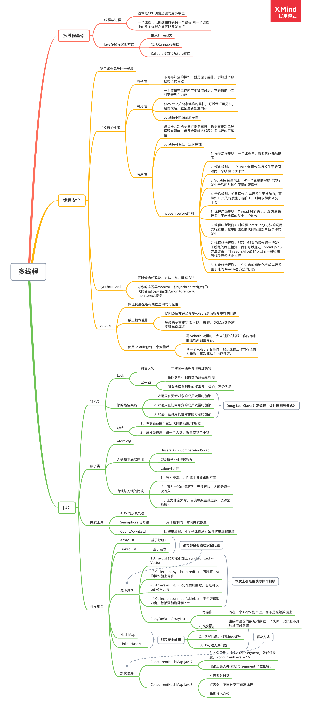

### Week04 作业

**1.（选做）**把示例代码，运行一遍，思考课上相关的问题。也可以做一些比较。

**2.（必做）**思考有多少种方式，在 main 函数启动一个新线程，运行一个方法，拿到这
个方法的返回值后，退出主线程? 写出你的方法，越多越好，提交到 GitHub。
一个简单的代码参考: [ https://github.com/kimmking/JavaCourseCodes/tree/main/03concurrency/0301 ](https://github.com/kimmking/JavaCourseCodes/tree/main/03concurrency/0301)/src/main/java/java0/conc0303/Homework03.java

**方法一：Thread.sleep(1000)**

只能“表面上”实现效果，子线程结束后再执行主线程，如果子线程执行时间未知就不可控了

```java
public static void main(String[] args) throws InterruptedException {
    Thread t1 = new Thread(new Runnable() {
        @Override
        public void run() {
            long start = System.currentTimeMillis();
            System.out.println(Thread.currentThread().getName() + " fibo(" + 10 + ")=" + MathUtil.fibo(10) + " 使用时间：" + (System.currentTimeMillis() - start) + " ms");
        }
    });
    t1.start();
    System.out.println("等待子线程执行完毕...");
    Thread.sleep(1000);
    System.out.println("继续执行主线程");
}
```

**方法二：join()**

调用`t1.join()`将主线程挂起，子线程结束后再继续执行

```java
public static void main(String[] args) throws InterruptedException {
    Thread t1 = new Thread(new Runnable() {
        @Override
        public void run() {
            long start = System.currentTimeMillis();
            System.out.println(Thread.currentThread().getName() + " fibo(15)=" + MathUtil.fibo(15) + " 使用时间：" + (System.currentTimeMillis() - start) + " ms");
        }
    });
    t1.start();
    System.out.println("等待子线程执行完毕...");
    t1.join();
    System.out.println("继续执行主线程");
}
```

**方法三：CountDownLatch**

使用最方便，可以指定多个子线程结束后，再继续执行主线程

```java
public static void main(String[] args) throws InterruptedException {
    final int sum = 2;
    CountDownLatch count = new CountDownLatch(sum);
    for (int i = 0; i < sum; i++) {
        int finalI = i+1;
        new Thread(new Runnable() {
            @Override
            public void run() {
                long start=System.currentTimeMillis();
                System.out.println(Thread.currentThread().getName()+ " fibo("+finalI*15+")=" + MathUtil.fibo(finalI*15) + " 使用时间："+ (System.currentTimeMillis()-start) + " ms");
                count.countDown();
            }
        }).start();
    }
    System.out.println("等待"+sum+"个子线程执行完毕...");
    count.await();
    System.out.println(sum+"个子线程已经执行完毕");
    System.out.println("继续执行主线程");
}
```

**3.（选做）**列举常用的并发操作 API 和工具类，简单分析其使用场景和优缺点。

[常用并发工具类](https://www.jianshu.com/p/3cdeda81c517)

**4.（选做）**请思考: 什么是并发? 什么是高并发? 实现高并发高可用系统需要考虑哪些 因素，对于这些你是怎么理解的?
**5.（选做）**请思考: 还有哪些跟并发类似 / 有关的场景和问题，有哪些可以借鉴的解决 办法。
**6.（必做）**把多线程和并发相关知识梳理一遍，画一个脑图，截图上传到 GitHub 上。 可选工具:xmind，百度脑图，wps，MindManage，或其他。

如果下方图片没有加载请点击：[思维导图](https://github.com/SkyMing1024/java-advanced-exercise/blob/main/Homework/week04(concurrency)/concurrent.png)



