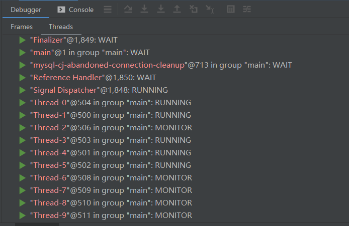

## WEEK07

**1.（选做）**用今天课上学习的知识，分析自己系统的 SQL 和表结构  
**2.（必做）**按自己设计的表结构，插入 100 万订单模拟数据，测试不同方式的插入效率  
**3.（选做）**按自己设计的表结构，插入 1000 万订单模拟数据，测试不同方式的插入效     

方式一：executeBatch() 循环执行

不小心发现吧`VALUES` 写成了`VALUE`，虽然不会报错，但是在大批量插入时会严重影响速度。

|                                | value      | values     |
| ------------------------------ | ---------- | ---------- |
| rewriteBatchedStatements=false | 用时：195s | 用时：210s |
| rewriteBatchedStatements=true  | 用时：190s | 用时：53s  |

还可以分批提交，一次性executeBatch 100万条也比较慢，可以没1000条数据执行一次插入

```java
		if (i%100==0){
                statement.executeBatch();
                statement.clearParameters();
           }
// 结果
1000000条插入完毕，用时：22s
```

~~~java
public static void main(String[] args) throws SQLException {
        final int num = 1000000;
        Connection connection = DBUtils.getConnection();
        connection.setAutoCommit(false);
        String sql = "INSERT INTO  t_order (user_id,sum_price,purchase_price,create_time,order_status) VALUES (?,?,?,?,?) ";
        PreparedStatement statement = connection.prepareStatement(sql);
        for (int i = 0; i < num; i++) {
            statement.setInt(1,1);
            statement.setString(2, String.valueOf(i));
            statement.setString(3, String.valueOf(i*0.9));
            statement.setString(4, DateUtil.getNowTime());
            statement.setString(5, String.valueOf(1));
            statement.addBatch();
        }
        long start = System.currentTimeMillis();
        statement.executeBatch();
        connection.commit();
        DBUtils.close();
        long diff =  (System.currentTimeMillis() - start)/1000;
        System.out.println(num+"条插入完毕，用时：" + diff + "s");
    }

//rewriteBatchedStatements = false
1000000条插入完毕，用时：190s
    
// rewriteBatchedStatements=true
1000000条插入完毕，用时：53s

// rewriteBatchedStatements=true，每1000条数据执行一次插入
1000000条插入完毕，用时：25s
    
~~~

方式二：多线程执行

~~~java
public static void main(String[] args) throws InterruptedException {
        // 插入数据总数
        int sum = 1000000;
        // 线程数
        int threadSum = 100;
        InsertByThead insert = new InsertByThead();
        CountDownLatch count = new CountDownLatch(threadSum);
        long start = System.currentTimeMillis();
        for (int i = 0; i < threadSum; i++) {
            new Thread(new Runnable() {
                @Override
                public void run() {
                    try {
                        System.out.println(Thread.currentThread().getName()+"开始插入数据");
                        insert.insert(sum / threadSum,Thread.currentThread().getName());
                        System.out.println(Thread.currentThread().getName()+"插入"+(sum / threadSum)+"条数据完毕");
                        count.countDown();
                    } catch (SQLException throwables) {
                        throwables.printStackTrace();
                    }
                }
            }).start();
        }
        System.out.println("等待"+threadSum+"个子线程执行完毕...");
        count.await();
        DBUtils.close();
        long diff =  (System.currentTimeMillis() - start)/1000;
        System.out.println(threadSum+"个子线程插入完毕，用时：" + diff + "s");
    }
~~~

有提升，但还是比较慢，可能是因为创建线程本身比较耗资源

~~~java
// 结果
Thread-1开始插入数据
......
Thread-7开始插入数据
等待10个子线程执行完毕...
Thread-8开始插入数据
Thread-9开始插入数据
Thread-0插入100000条数据完毕
......
Thread-7插入100000条数据完毕
10个子线程插入完毕，用时：32s
~~~



**4.（选做）**使用不同的索引或组合，测试不同方式查询效率  
**5.（选做）**调整测试数据，使得数据尽量均匀，模拟 1 年时间内的交易，计算一年的销售报表：销售总额，订单数，客单价，每月销售 量，前十的商品等等（可以自己设计更多指标）  
**6.（选做）**尝试自己做一个 ID 生成器（可以模拟 Seq 或 Snowflake）  
**7.（选做）**尝试实现或改造一个非精确分页的程序  
**8.（选做）**配置一遍异步复制，半同步复制、组复制  
**9.（必做）**读写分离 - 动态切换数据源版本 1.0  
**10.（必做）**读写分离 - 数据库框架版本 2.0  

这部分还没搞定，我再看看视频

**11.（选做）**读写分离 - 数据库中间件版本 3.0  
**12.（选做）**配置 MHA，模拟 master 宕机  
**13.（选做）**配置 MGR，模拟 master 宕机  
**14.（选做）**配置 Orchestrator，模拟 master 宕机，演练 UI 调整拓扑结构  

